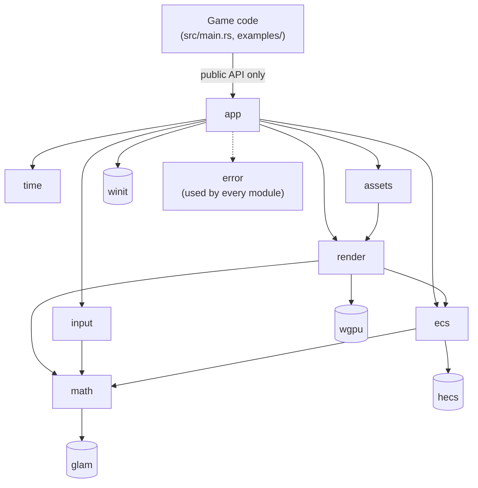
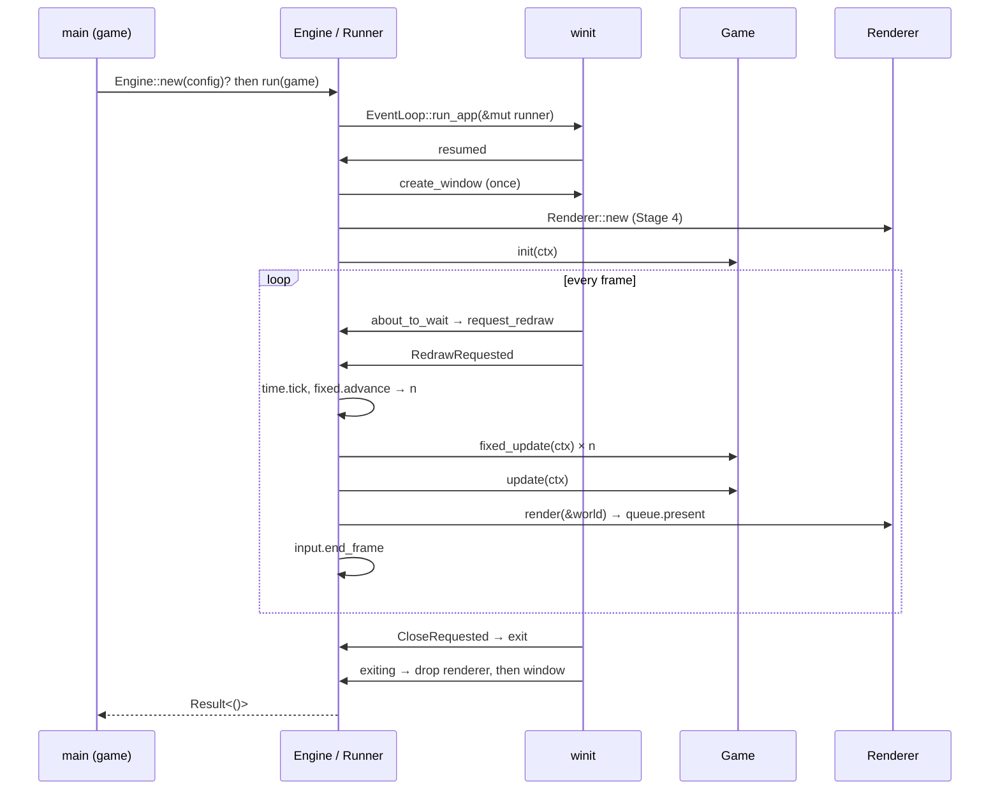

# PurplePie Architecture

Last reviewed: **2026-09-30** against the repository at the end of Stage 0.

Every section separates **Current** (exists and is validated in the repository)
from **Planned** (decided in [DECISIONS.md](DECISIONS.md), not yet built).
When code and this file disagree, the code plus validation wins, and this file
must be corrected ([DEVELOPMENT.md §7](DEVELOPMENT.md#7-architectural-drift)).

---

## 1. System Overview

**PurplePie is** a small, modular, desktop 2D game engine library in Rust.
Games are separate binaries that implement a `Game` trait. The engine owns the
window, event loop, time, ECS world, input state and GPU renderer.

**PurplePie is not:**
- a 3D engine, even though wgpu could do 3D;
- a general application framework or a Bevy-style plugin/scheduler system;
- a web or mobile engine (not a goal for now);
- an editor (possible much later).

**Current reality:** a compiling scaffold. `purplepie` exposes only `VERSION`,
and the `sandbox` binary prints it. There is no window, no ECS and no GPU code yet.

---

## 2. Architectural Principles

Priority order when principles conflict: **simplicity → correctness →
compilability → clear architecture → maintainability → extensibility → performance.**

| Principle | What it means here |
|---|---|
| 2D-only scope | Public types are 2D (`Transform2D`, `Camera2D`, `Sprite`). No depth buffer or 3D camera in the API. |
| Rust-first | Stable Rust, edition 2024, `unsafe_code = "forbid"` (ADR-001). |
| Modularity | One responsibility per module. A module exists only once it has a user (ADR-003). |
| Composition | Behavior comes from ECS components + plain-function systems, not inheritance-like trait hierarchies. |
| Low coupling | `winit` only in `app`, `wgpu` only in `render`. ECS and math never depend on rendering. |
| Explicit APIs | No implicit systems, no global state, no hidden schedulers. Game code calls systems itself. |
| Incremental development | One verified stage at a time, each a runnable vertical slice ([ROADMAP.md](ROADMAP.md)). |
| No premature overengineering | No traits, generics, `Arc`/`Mutex`/`RefCell` or dependencies without a present need. |

---

## 3. Module Responsibilities

### Current

| Path | Responsibility | Status |
|---|---|---|
| `src/lib.rs` | Crate root: `pub const VERSION`, crate docs, one unit test + one doctest | VERIFIED |
| `src/main.rs` | `sandbox` binary: prints the version using only the public API | VERIFIED |
| `assets/{textures,fonts,shaders}/` | Runtime data folders (empty, `.gitkeep`) | Placeholder |

### Planned (ADR-003)

| Module | Responsibility | May depend on | Must NOT depend on | Future extension points | Stage |
|---|---|---|---|---|---|
| `error` | `Error` enum, `Result<T>` | `thiserror`; wraps winit/wgpu error types | any internal module | new variants per failure domain | 1 |
| `app` | `Engine`, `EngineConfig`, `Game`, `Context`, `Runner` (winit `ApplicationHandler`), frame orchestration | all engine modules, `winit` | — (top of the engine) | multiple windows (not planned), headless runner for tests | 1 |
| `time` | `Time` (delta, elapsed, frame count), `FixedTimestep` | `std` only | `winit`, `wgpu`, `hecs` | interpolation alpha, time scale/pause | 2 |
| `math` | `Transform2D`; re-exports `Vec2`, `Affine2`, `Mat4` | `glam` | everything internal | rect/AABB helpers when needed | 3 |
| `ecs` | Re-exports `World`, `Entity`; engine components (`Velocity`); systems (`integrate_velocity`) | `hecs`, `math` | `render`, `app`, `input`, `wgpu`, `winit` | hierarchy/parenting, command buffers | 3 |
| `render` | `pub(crate) Renderer`, `GpuContext`, pipelines; public data types `Color`, `Sprite`, `Camera2D` | `wgpu`, `pollster`, `math`, `ecs` (read-only) | `app`, `input`, `winit` types beyond the `Arc<Window>` handed in | `SpriteRenderer`, `ShapeRenderer`, `TextRenderer`, `DebugRenderer` | 4–7 |
| `input` | `Input` state (pressed / just_pressed / just_released), `KeyCode`, `MouseButton` | `math` | `winit` (translation lives in `app`), `render` | gamepad, text input, action mapping | 8 |
| `assets` | `Handle<T>`, `Assets` store, loaders | `render` (GPU upload), `std::fs` | `app`, `input` | hot reload, async loading | 9 |

**Not present: `core`.** See ADR-003. It had no single responsibility and
shadows Rust's built-in `core` crate.

---

## 4. Dependency Direction

Planned graph (arrows mean "depends on"). Nothing here exists in `src/` yet except the
lib/bin split.



Rules:
1. Edges only point downward. An upward import is a design bug.
2. `ecs` and `math` never depend on `render`, `app`, `input` or GPU/window crates.
3. `render` reads the `World` but never writes game state (ADR-009).
4. `time` depends only on `std`.
5. Forbidden cycles: `render → ecs → render`, `app ↔ error`, `game → render internals → game`.

Currently enforced by the compiler: `main.rs` can reach only `pub` items of `purplepie` (ADR-002).

---

## 5. Runtime Flow

### Current
```text
main() → println!("PurplePie sandbox v{VERSION} …") → exit 0
```

### Planned (ADR-008, ADR-010): winit 0.30 `ApplicationHandler`


Fixed-step constants: `FIXED_DT = 1/60 s`, `MAX_FRAME_DT = 0.25 s`,
`MAX_FIXED_STEPS = 5`, backlog clamped to below one step when the cap is hit.
Stages 1–3 use `ControlFlow::WaitUntil`. From Stage 4, `Poll` + vsync (`Fifo`).

---

## 6. Engine/Game Boundary

| Game code **may** use | Game code **may not** see |
|---|---|
| `Engine`, `EngineConfig`, `Game`, `Context`, `Result`/`Error` | `wgpu::{Device, Queue, Surface, RenderPipeline, …}` |
| `World`, `Entity`, components (`Transform2D`, `Velocity`, `Sprite`, …) | `winit::window::Window`, raw winit events |
| `Time`, `Input`, `KeyCode`, `Color`, `Camera2D`, `Handle<T>` | `Renderer`, `Runner`, `GpuContext` (`pub(crate)`) |
| built-in system functions (`ecs::integrate_velocity`) | engine-internal state outside `Context` |

The engine runs no gameplay systems implicitly. Order is visible in the game's `fixed_update`.

---

## 7. Rendering Architecture

**Current:** none. A throwaway spike (outside `src/`) verified the wgpu 30 path
and rendered a purple clear under Xvfb + lavapipe
([spikes/stage-0-compat-spike.md](spikes/stage-0-compat-spike.md)).

**Planned (ADR-005, ADR-009):**
```text
Instance::new(InstanceDescriptor::new_with_display_handle(owned_display_handle))
 → create_surface(Arc<Window>) → request_adapter(compatible_surface)
 → request_device → surface.get_default_config → configure
frame: get_current_texture() → render pass → queue.submit → pre_present_notify → queue.present
```

| `CurrentSurfaceTexture` / condition | Action |
|---|---|
| `Success` | draw, present |
| `Suboptimal` | draw, present, then reconfigure |
| `Timeout`, `Occluded` | skip the frame |
| `Outdated` | reconfigure, skip |
| `Lost` | recreate the surface, reconfigure, skip |
| `Validation` | log, skip. Repeated failures become `Error::Render` |
| OOM / device lost | reported via `on_uncaptured_error` / `set_device_lost_callback`, which become `Error::Render` and exit |
| size 0×0 (minimized) | never configure. Skip rendering. |

Evolution, each part added only when a stage needs it:
`Renderer { gpu, sprites (Stage 5–6), shapes, text, debug (later) }`.

---

## 8. ECS Architecture

**Current:** none (no `hecs` dependency yet).

**Planned (ADR-006, ADR-008):**
- **Implementation:** `hecs 0.11.1`, archetypal storage.
- **World ownership:** exactly one `hecs::World`, owned by the runner, lent to
  the game as `ctx.world: &mut World` for each callback.
- **Components:** plain data structs. The first set is `Transform2D`, `Velocity`, then `Sprite`.
  No wgpu handles in components.
- **Systems:** free functions, e.g. `fn integrate_velocity(world: &mut World, dt: f32)`,
  called explicitly by the game. There is no scheduler.
- **Resources:** hecs has none. Engine-wide state (`Time`, `Input`, later
  `Assets`) lives in `Context`. Game-specific state lives in the `Game` struct.
- **Structural changes during iteration:** `hecs::CommandBuffer` or collect-then-apply.

---

## 9. Error Handling

**Current:** lints only: `unsafe_code = "forbid"`, `clippy::unwrap_used = "warn"`.

**Planned (ADR-011):** one `purplepie::Error` (`thiserror`) and
`purplepie::Result<T>`. Callback errors are stored and returned from
`Engine::run`. Diagnostics use the `log` facade, and the engine never installs a logger.

---

## 10. Async Strategy

**Current:** no async code.

**Planned (ADR-012):** only the two wgpu init futures, resolved with
`pollster::block_on` in `resumed`. No async runtime and no `async` in the public API.

---

## 11. Testing Architecture

| Layer | Approach | Current |
|---|---|---|
| Crate sanity | unit test `version_matches_manifest`, doctest on `VERSION` | ✅ 2 tests pass |
| `time`, `math`, `ecs` systems, `input` state | pure unit tests, no window/GPU | planned (Stages 2, 3, 8) |
| Game logic | build `World`/`Time`/`Input` headless, call game methods | planned (Stage 3+) |
| `app`, `render` | `cargo build` + smoke run: Linux Xvfb + Mesa lavapipe in Cowork; Windows by the owner | planned (Stages 1, 4) |
| Every change | `cargo fmt --check`, `cargo check --all-targets`, `cargo clippy --all-targets -- -D warnings`, `cargo test`, `cargo build` | ✅ in use |

Tests live next to code in `#[cfg(test)] mod tests`. Integration tests go in `tests/`
once the public API has behavior worth testing.
