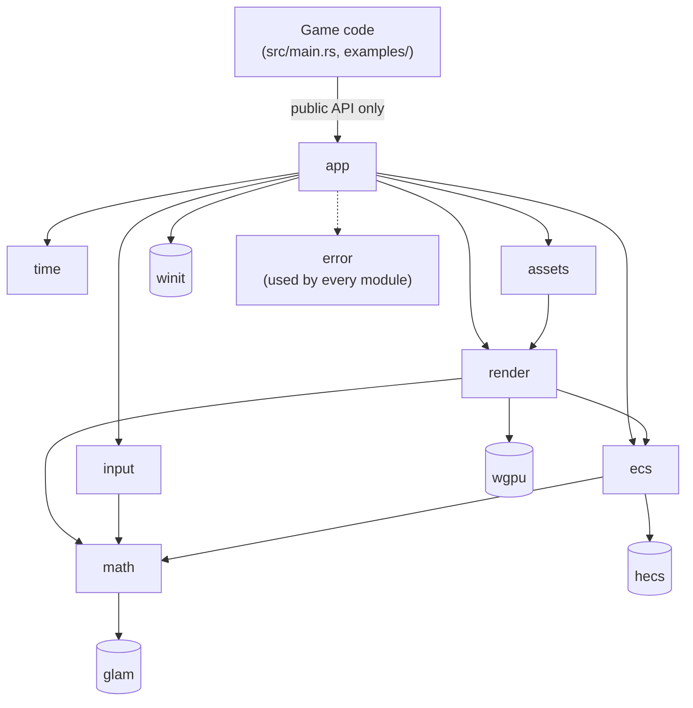
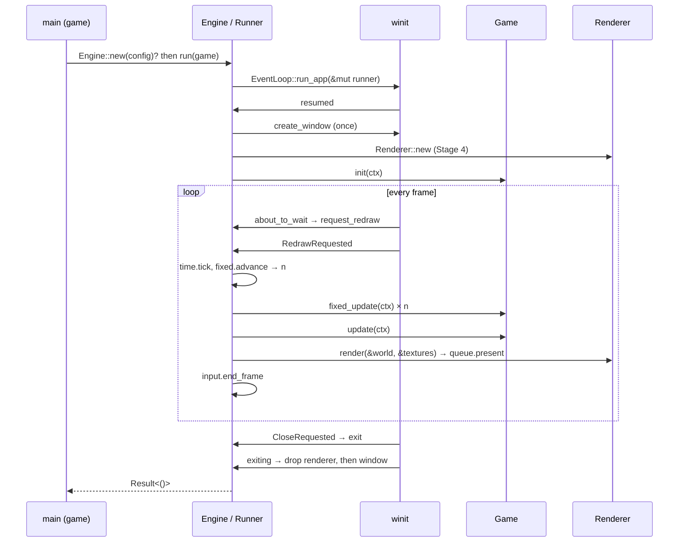

# PurplePie Architecture

Last reviewed: **2026-10-01** against the repository after Stage 5 (PP-007).

Every section separates **Current** (exists and is validated in the repository)
from **Planned** (decided in [DECISIONS.md](DECISIONS.md), not yet built).
When code and this file disagree, the code plus validation wins, and this file
must be corrected ([DEVELOPMENT.md §7](DEVELOPMENT.md#7-architectural-drift)).

---

## 1. System Overview

**PurplePie is** a small, modular, desktop 2D game engine library in Rust.
Games are separate binaries that implement a `Game` trait. The engine owns the
window, event loop, time, ECS world, input state and GPU renderer.

**PurplePie is not:**
- a 3D engine, even though wgpu could do 3D;
- a general application framework or a Bevy-style plugin/scheduler system;
- a web or mobile engine (not a goal for now);
- an editor (possible much later).

**Current reality (Stage 6, PP-008):** `purplepie` provides `Engine`,
`EngineConfig`, `Game`, `Context` (incl. `load_texture`), `Time`, `Error`, and the public modules `ecs`
(`World`, `Entity`, `Velocity`, `integrate_velocity`), `math` (`Transform2D`,
`Vec2`, `Mat4`) and `render` (`Color`, `Quad`, `Sprite`, `TextureId`). Every frame the engine clears the
window, draws each entity that has `Transform2D` + `Quad` as a solid-colour
rectangle (ADR-018 coordinates, ADR-019 pipeline), then each entity with `Transform2D` + `Sprite`
as a textured rectangle (ADR-020). The `sandbox` game shows three
reference quads (one moving) and two sprites from one PNG (one tinted and spinning). There is no
draw-order control, camera or input abstraction yet.

---

## 2. Architectural Principles

Priority order when principles conflict: **simplicity → correctness →
compilability → clear architecture → maintainability → extensibility → performance.**

| Principle | What it means here |
|---|---|
| 2D-only scope | Public types are 2D (`Transform2D`, `Camera2D`, `Sprite`). No depth buffer or 3D camera in the API. |
| Rust-first | Stable Rust, edition 2024, `unsafe_code = "forbid"` (ADR-001). |
| Modularity | One responsibility per module. A module exists only once it has a user (ADR-003). |
| Composition | Behavior comes from ECS components + plain-function systems, not inheritance-like trait hierarchies. |
| Low coupling | `winit` only in `app`, `wgpu` only in `render`. ECS and math never depend on rendering. |
| Explicit APIs | No implicit systems, no global state, no hidden schedulers. Game code calls systems itself. |
| Incremental development | One verified stage at a time, each a runnable vertical slice ([ROADMAP.md](ROADMAP.md)). |
| No premature overengineering | No traits, generics, `Arc`/`Mutex`/`RefCell` or dependencies without a present need. |

---

## 3. Module Responsibilities

### Current

| Path | Responsibility | Status |
|---|---|---|
| `src/lib.rs` | Crate root: re-exports the public API, `VERSION` | VERIFIED |
| `src/error.rs` | `Error` (`#[non_exhaustive]`: `InvalidConfig`, `EventLoop`, `Window`, `Surface`, `Adapter`, `Device`, `SurfaceUnsupported`, `Render`, `Asset { path, source }`, `Game`), `BoxError`, `Result`. winit/wgpu/image errors are boxed sources, not public types. | VERIFIED |
| `src/app/mod.rs` | `Engine::new` (validates config, creates the `EventLoop`) and `Engine::run` (runs the runner, returns the first error) | FUNCTIONAL (Linux) |
| `src/app/config.rs` | `EngineConfig`: title, size, resizable, `exit_on_escape`, `fixed_dt`, `max_frame_dt`, `max_fixed_steps` + builders + `validate` | VERIFIED |
| `src/app/game.rs` | `Game` trait (`init`, `fixed_update`, `update`, all with defaults); `Context` (`world()`, `world_mut()`, `time()`, `dt()`, `load_texture(path)`, `texture_size(id)`, `request_exit()`, `exit_requested()`) | VERIFIED |
| `src/time/mod.rs` | `Time` (public, read-only): clamped delta, elapsed game time, frame number, `fixed_dt`, total fixed steps, `alpha` | VERIFIED |
| `src/time/fixed.rs` | `FixedTimestep` (`pub(crate)`): accumulator, step cap, backlog clamp, alpha. `std` only. | VERIFIED |
| `src/math/mod.rs` | `pub mod math`: `Transform2D { position, rotation, scale }` (+ `IDENTITY`, builders, `to_mat4()`), re-exported `glam::{Vec2, Mat4}` | VERIFIED |
| `src/ecs/mod.rs` | `pub mod ecs`: re-exports `hecs::{World, Entity}` and the `hecs` crate; `Velocity(Vec2)`; `integrate_velocity(&mut World, dt)` | VERIFIED |
| `src/render/mod.rs` | `pub mod render`: public `Color`, `Quad`, `Sprite`, `TextureId`; crate-private `Renderer`, `Textures` | VERIFIED |
| `src/render/quad.rs` | Public `Quad { size, color }` component. Crate-private `view_projection` (ADR-018), `collect_instances(&World, …)`, `QuadPipeline`, `rect_pipeline` (pipeline builder shared with sprites; ADR-019) | VERIFIED (unit tests, 2 ignored GPU tests, Xvfb pixel checks) |
| `src/render/instance.rs` | `Instance` (80 B Pod: clip matrix + colour/tint) and `InstanceBuffer` (growable vertex buffer), shared by quads and sprites | VERIFIED |
| `src/render/texture.rs` | Public `TextureId`. Crate-private `Textures` store (decoded RGBA8 in load order, path → id cache; owned by the runner) and `decode_png` (ADR-020) | VERIFIED (unit tests) |
| `src/render/sprite.rs` | Public `Sprite { texture, size, tint }`. Crate-private `collect_sprites` (+ same-texture batches), `SpritePipeline` (bind group per texture, `Nearest` sampler, `sync_textures` uploads new store entries; ADR-020) | VERIFIED (unit tests, 2 ignored GPU tests, Xvfb pixel checks) |
| `src/render/sprite.wgsl` | Sprite shader: the quad scheme plus UVs (top row = v 0) and `textureSample × tint` | VERIFIED |
| `src/render/quad.wgsl` | Quad shader (corners from `vertex_index`, per-instance clip matrix + colour), embedded with `include_str!` | VERIFIED |
| `src/render/color.rs` | `Color` (sRGB, straight alpha): constructors, `PURPLEPIE` `#6A0DAD`, `to_linear`, `to_wgpu(target_is_srgb)` (ADR-015) | VERIFIED |
| `src/render/renderer.rs` | `Renderer` (`pub(crate)`): wgpu surface/device/queue/config; `new`, `resize`, `render(&World, &Textures, before_present)`; texture sync; acquire-result policy; `AutoVsync` (ADR-014); fault checks (ADR-017) | VERIFIED (Linux/lavapipe; purple window confirmed on Windows by the owner) |
| `src/render/faults.rs` | `FaultSlot` (first-fault-wins `Arc<Mutex<Option<GpuFault>>>`) + `GpuFault`; installs wgpu's uncaptured-error and device-lost callbacks (ADR-017) | VERIFIED (unit tests + ignored GPU test under lavapipe) |
| `src/app/pacer.rs` | `FramePacer`: 60 Hz `WaitUntil` deadlines, no catch-up bursts. Interim until Stage 4 vsync. | VERIFIED |
| `src/app/runner.rs` | `Runner<G>`: winit `ApplicationHandler`; the only code handling winit events | FUNCTIONAL (Linux) |
| `src/main.rs` | `sandbox` binary: a `Game` using only the public API. Optional timed exit via env var. | FUNCTIONAL (Linux) |
| `assets/textures/sandbox_quadrants.png` | 16×16 test image for the sandbox and unit tests (four colour quadrants, transparent border, one 50% alpha quadrant) | VERIFIED |
| `assets/{fonts,shaders}/` | Runtime data folders (empty, `.gitkeep`) | Placeholder |

### Planned (ADR-003)

| Module | Responsibility | May depend on | Must NOT depend on | Future extension points | Stage |
|---|---|---|---|---|---|
| `error` | `Error` enum, `Result<T>` | `thiserror`; wraps winit/wgpu error types | any internal module | new variants per failure domain | 1 |
| `app` | `Engine`, `EngineConfig`, `Game`, `Context`, `Runner` (winit `ApplicationHandler`), frame orchestration | all engine modules, `winit` | — (top of the engine) | multiple windows (not planned), headless runner for tests | 1 |
| `time` | `Time` (delta, elapsed, frame count), `FixedTimestep` | `std` only | `winit`, `wgpu`, `hecs` | interpolation alpha, time scale/pause | 2 |
| `math` | `Transform2D`; re-exports `Vec2`, `Affine2`, `Mat4` | `glam` | everything internal | rect/AABB helpers when needed | 3 |
| `ecs` | Re-exports `World`, `Entity`; engine components (`Velocity`); systems (`integrate_velocity`) | `hecs`, `math` | `render`, `app`, `input`, `wgpu`, `winit` | hierarchy/parenting, command buffers | 3 |
| `render` | `pub(crate) Renderer`, pipelines, texture store; public data types `Color`, `Quad`, `Sprite`, `TextureId`, `Camera2D` | `wgpu`, `pollster`, `image` (PNG decode), `math`, `ecs` (read-only) | `app`, `input`, `winit` (the window arrives as `Arc<dyn wgpu::WindowHandle>`, the display as `impl wgpu::wgt::WgpuHasDisplayHandle`) | `SpriteRenderer`, `ShapeRenderer`, `TextRenderer`, `DebugRenderer` | 4–7 |
| `input` | `Input` state (pressed / just_pressed / just_released), `KeyCode`, `MouseButton` | `math` | `winit` (translation lives in `app`), `render` | gamepad, text input, action mapping | 8 |
| `assets` | `Handle<T>`, `Assets` store, loaders | `render` (GPU upload), `std::fs` | `app`, `input` | hot reload, async loading | 9 |

**Not present: `core`.** See ADR-003. It had no single responsibility and
shadows Rust's built-in `core` crate.

---

## 4. Dependency Direction

Planned graph (arrows mean "depends on"). Nothing here exists in `src/` yet except the
lib/bin split.



Rules:
1. Edges only point downward. An upward import is a design bug.
2. `ecs` and `math` never depend on `render`, `app`, `input` or GPU/window crates.
3. `render` reads the `World` but never writes game state (ADR-009).
4. `time` depends only on `std`.
5. Forbidden cycles: `render → ecs → render`, `app ↔ error`, `game → render internals → game`.

Currently enforced by the compiler: `main.rs` can reach only `pub` items of `purplepie` (ADR-002).

---

## 5. Runtime Flow

### Current (Stage 6, PP-008)
```text
main → Engine::new(config)?          validate config, EventLoop::new()
     → engine.run(game)              EventLoop::run_app(&mut Runner)
resumed          → create Arc<Window> (once) → Renderer::new (if none; error → exit)
                   → game.init(ctx) (once; error → exit). ctx.load_texture decodes now → Textures
                     (CPU, owned by the runner; outlives renderers: a new one re-uploads all)
about_to_wait    → FramePacer: if a frame is due, request_redraw; ControlFlow::WaitUntil(next deadline)
RedrawRequested  → FRAME (skipped once exit has begun):
                     raw = now − last_frame (0 on the first frame)
                     delta = time.begin_frame(raw, max_frame_dt)       clamp to [0, max_frame_dt]
                     n = fixed.advance(delta)                          ≤ max_fixed_steps, backlog clamped
                     repeat n: game.fixed_update(ctx, dt = fixed_dt)   stop early on request_exit
                     time.set_alpha(fixed.alpha())
                     game.update(ctx, dt = delta)                      unless exit requested
                     renderer.render(&world, &textures, pre_present_notify)   unless exit requested; Err → exit
                       (upload new textures → collect (Transform2D, Quad) and (Transform2D, Sprite)
                        → upload instances → clear + one quad draw + one sprite draw per texture run)
Resized / ScaleFactorChanged → renderer.resize(w, h, scale_factor)   0×0 = minimized: skip rendering
CloseRequested / Escape (if enabled) / ctx.request_exit() → event_loop.exit()
suspended        → drop Renderer (recreated in resumed; world and time are kept)
exiting          → drop Renderer, then Window
run returns      → first stored error, else any event-loop error, else Ok(())
```
Game callbacks are never invoked after `event_loop.exiting()` becomes true.
`exit()` does not discard events that are already queued, and a bug caused by
this was found and fixed in PP-003.

### Planned full frame (ADR-008, ADR-010)


Fixed-step constants: `FIXED_DT = 1/60 s`, `MAX_FRAME_DT = 0.25 s`,
`MAX_FIXED_STEPS = 5`, backlog clamped to below one step when the cap is hit.
All stages use `ControlFlow::WaitUntil` with a 60 Hz redraw cap, plus `PresentMode::AutoVsync` from Stage 4 (ADR-014, which supersedes the original plan of switching to `Poll` + `Fifo`).

---

## 6. Engine/Game Boundary

| Game code **may** use | Game code **may not** see |
|---|---|
| `Engine`, `EngineConfig`, `Game`, `Context`, `Result`/`Error`/`BoxError` | `wgpu::{Device, Queue, Surface, RenderPipeline, …}` |
| `World`, `Entity`, components (`Transform2D`, `Velocity`, `Sprite`, …) | `winit::window::Window`, raw winit events |
| `Time`, `Input`, `KeyCode`, `Color`, `TextureId`, `Camera2D`, `Handle<T>` | `Renderer`, `Runner`, `Textures` (`pub(crate)`), `image` types |
| built-in system functions (`ecs::integrate_velocity`) | engine-internal state outside `Context` |

The engine runs no gameplay systems implicitly. Order is visible in the game's `fixed_update`.

---

## 7. Rendering Architecture

**Current (Stages 4–6; ADR-005, ADR-009, ADR-014, ADR-015, ADR-017, ADR-018, ADR-019, ADR-020):** a single
crate-private `Renderer` that clears the window to `EngineConfig::clear_color`
every frame, then draws all `(Transform2D, Quad)` entities in one instanced draw
call, then all `(Transform2D, Sprite)` entities (see "Quads and coordinates" and "Sprites and textures" below). It is verified pixel-exact under Xvfb + lavapipe, and the owner confirmed the
same purple on Windows with a real GPU. The chain below is implemented as
shown, with `SurfaceTarget::from_window_without_display` because the display
handle goes through the `InstanceDescriptor`. Right after `request_device`,
PurplePie's `FaultSlot` replaces wgpu's panicking uncaptured-error handler
and the device-lost callback. Not yet: draw-order control (PP-015).

```text
Instance::new(InstanceDescriptor::new_with_display_handle(owned_display_handle))
 → create_surface(Arc<Window>) → request_adapter(compatible_surface)
 → request_device → surface.get_default_config → configure
frame: get_current_texture() → render pass → queue.submit → pre_present_notify → queue.present
```

| `CurrentSurfaceTexture` / condition | Action |
|---|---|
| `Success` | draw, present |
| `Suboptimal` | draw, present, then reconfigure |
| `Timeout`, `Occluded` | skip the frame |
| `Outdated` | reconfigure, skip |
| `Lost` | **fatal:** `Error::Render(SurfaceLost)`. No recreation, because it panics in wgpu-hal 30.0.1 when the window is gone (ADR-017) |
| `Validation` | **fatal:** `Error::Render` with the recorded uncaptured error (or `AcquireValidation`) |
| Uncaptured wgpu error (validation / OOM / internal) | recorded by `FaultSlot`, checked before and after each frame and after init, becomes `Error::Render`, clean exit |
| Device lost, `Unknown` | same as above. `Destroyed` (self-inflicted) is ignored |
| size 0×0 (minimized) | never configure. Skip rendering. |

### Quads and coordinates (Stage 5)

```text
world (ADR-018): +X right, +Y up, origin = window centre, 1 unit = 1 logical px
logical size = physical size / scale_factor     resize → more world visible, same scale
per quad (CPU): clip_from_local = view_projection(logical) × Transform2D::to_mat4() × scale(size)
                color = Color::to_wgpu(surface is sRGB)            (ADR-015)
GPU: one pipeline, no vertex buffer, no bind group. draw(0..6, 0..n). Corners from vertex_index.
```
Draw order is ECS query order and is not specified yet (PD-08, PP-015). There is no MSAA,
and alpha blending is straight alpha.

### Sprites and textures (Stage 6, ADR-020)

```text
game:  id = ctx.load_texture(path)?        read + decode PNG now → Error::Asset on failure
       spawn((Transform2D, Sprite::new(id, size).with_tint(c)))
store: Textures (runner-owned, CPU): RGBA8 sRGB straight alpha, load order = TextureId, never unloaded
frame: sprites.sync_textures(store)        upload entries ≥ uploaded count; > max_texture_dimension_2d → Error::Asset
       texture format = Rgba8UnormSrgb if surface is sRGB else Rgba8Unorm   (same blend space as quads, ADR-015)
       per sprite: Instance { clip_from_local, tint }  (same 80 B layout as quads)
       consecutive sprites with the same texture → one draw(0..6, range) with that texture's bind group
       sampler: Nearest, ClampToEdge, no mipmaps.   UV: v = 0 at the top edge (image row 0)
order: quads first, then sprites; within each, ECS query order (PP-015 adds layers)
```

Evolution, each part added only when a stage needs it:
`Renderer { quads (Stage 5 ✅), sprites + textures (Stage 6 ✅ PP-008), layers + batching (PP-015), camera (Stage 7), text/debug (later) }`.

---

## 8. ECS Architecture

**Current (Stage 3, ADR-006, ADR-008):**
- **Implementation:** `hecs 0.11.1`, archetypal storage.
- **World ownership:** exactly one `hecs::World`, owned by the runner and lent to
  the game in every callback through `ctx.world()` / `ctx.world_mut()`. Because
  `world_mut()` borrows the context exclusively, read `ctx.dt()` into a local first.
- **Components so far:** `math::Transform2D`, `ecs::Velocity`, `render::Quad` and `render::Sprite` (drawn by the renderer). `Sprite` holds a plain `TextureId`, never a GPU object.
- **Systems so far:** `ecs::integrate_velocity(world, dt)`, called by the sandbox from `fixed_update`.
- **Components:** plain data structs. The first set is `Transform2D`, `Velocity`, then `Sprite`.
  No wgpu handles in components.
- **Systems:** free functions, e.g. `fn integrate_velocity(world: &mut World, dt: f32)`,
  called explicitly by the game. There is no scheduler.
- **Resources:** hecs has none. Engine-wide state (`Time`, `Input`, later
  `Assets`) lives in `Context`. Game-specific state lives in the `Game` struct.
- **Structural changes during iteration:** `hecs::CommandBuffer` or collect-then-apply.

---

## 9. Error Handling

**Current:** `purplepie::Error` with boxed `source`s. `Error::game(e)` wraps game errors.
Errors raised inside winit callbacks are stored by the runner (first one wins),
followed by `event_loop.exit()`, and returned from `Engine::run`. The sandbox
prints the full `source()` chain. GPU setup failures map to `Error::{Surface,
Adapter, Device, SurfaceUnsupported}`. GPU runtime faults map to `Error::Render`
(ADR-017) and end the loop the same way. Diagnostics use the `log` facade
(ADR-016). The engine never installs a logger, and the sandbox has a built-in stderr
logger controlled by `PURPLEPIE_LOG` (default `warn`).
The lints `unsafe_code = "forbid"` and `clippy::unwrap_used = "warn"` apply. `src/` contains no `unwrap`, and `expect` is used only in tests.

**Planned (ADR-011):** one `purplepie::Error` (`thiserror`) and
`purplepie::Result<T>`. Callback errors are stored and returned from
`Engine::run`. Diagnostics use the `log` facade, and the engine never installs a logger.

---

## 10. Async Strategy

**Current:** no async code.

**Planned (ADR-012):** only the two wgpu init futures, resolved with
`pollster::block_on` in `resumed`. No async runtime and no `async` in the public API.

---

## 11. Testing Architecture

| Layer | Approach | Current |
|---|---|---|
| `error`, `app::{config, game, pacer}`, `time`, `math`, `ecs`, `render::{Color, faults, quad, instance, texture, sprite}` | pure unit tests + doctests | ✅ 68 unit tests + 12 doctests |
| GPU-dependent code paths (`FaultSlot`, quad and sprite pipelines, texture upload and size limit, shader errors on a real device) | `#[ignore]` tests, run with `cargo test -- --ignored` where a GPU/lavapipe exists (not in CI) | ✅ 5 ignored tests pass under lavapipe |
| Rendered output | Xvfb screenshots analysed per pixel (`docs/DEVELOPMENT.md` §8): exact rectangles, colours, texels, alpha blends, motion, resize behaviour | ✅ Stages 5–6 |
| Every push | GitHub Actions `.github/workflows/ci.yml`: fmt + clippy (Linux); `cargo check` + `cargo test` on Linux, Windows, macOS | configured; first run pending |
| `input` state | pure unit tests, no window/GPU | planned (Stage 8) |
| Game logic | build `World`/`Time`/`Input` headless, call game methods | planned (Stage 3+) |
| `app` runner, `render::Renderer` | Xvfb + lavapipe smoke runs in Cowork (xdotool XTEST keys, `WM_DELETE_WINDOW` close, `xwininfo`, CPU sampling, screenshot color histograms); Windows by the owner | ✅ Stages 1–6 on Linux; Windows pending |
| Every change | `cargo fmt --check`, `cargo check --all-targets`, `cargo clippy --all-targets -- -D warnings`, `cargo test`, `cargo build` | ✅ in use |

Tests live next to code in `#[cfg(test)] mod tests`. Integration tests go in `tests/`
once the public API has behavior worth testing.
